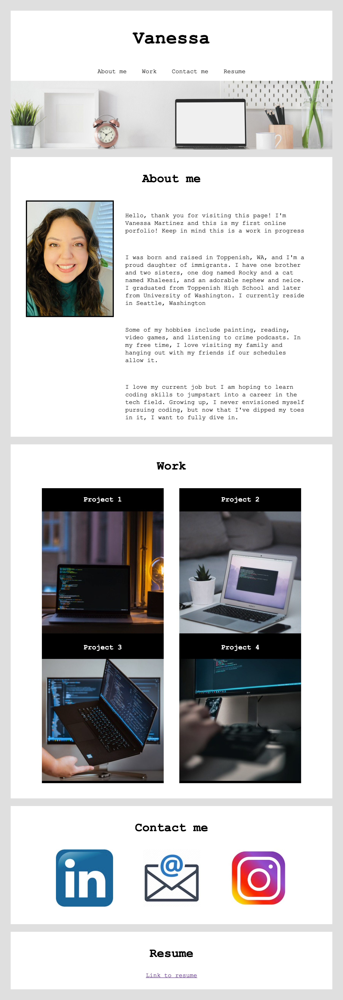

# Portfolio

## Description
First online portfolio to showcase core skills learned so far during UW Coding Bootcamp course. Goal is to demonstrate to potential future employers of known skills needed to fulfill a part-time or full-time position.

With a "minimalist" theme in mind, background, body, and font colors where kept to black, grey, and white.  All headers along with content were center aligned to keep overall look uniform. All clickable items transform to let user know item contains a link. 

This online portfolio will continue to change and evolve as new coding skills are gained throughout the corse.

## Deployed Application
URL of deployed application [Vanessa's Online Portfolio] (https://marvanessa1.github.io/Portfolio/).

## Portfolio Mock-Up

The screenshots below demonstrate the web application's apperence and funtionality:

Screenshot image

   
Screenshot GIF

